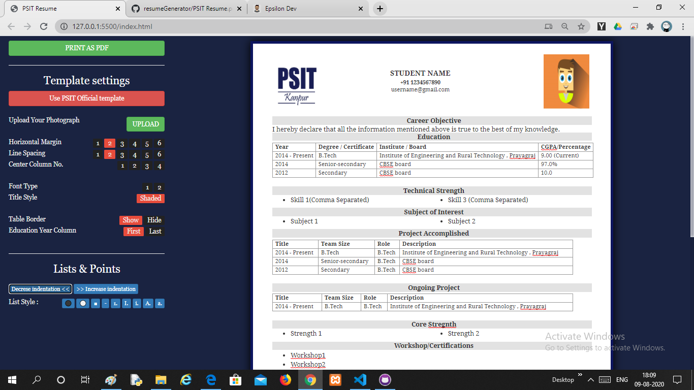
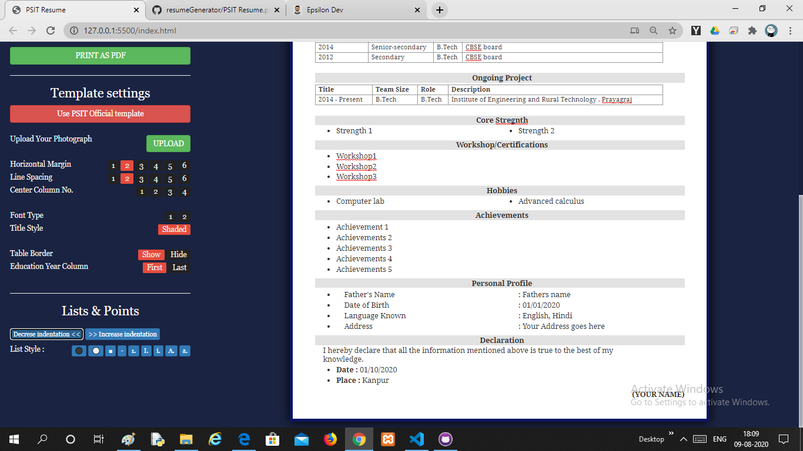
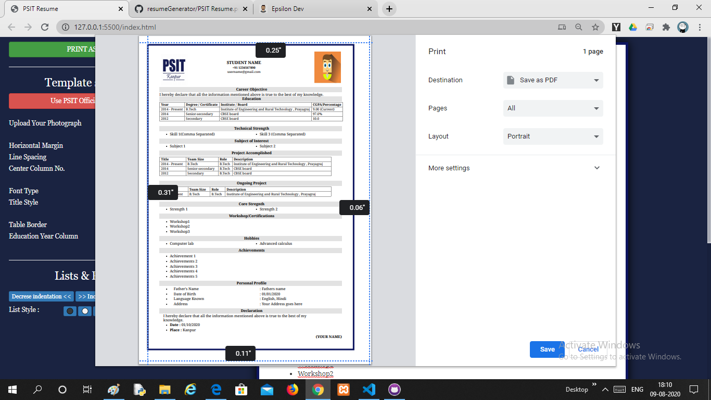

# resumeGenerator
 Simple college resume generator using javaScript, html, css
 
 

**Note** : Use Google Chrome
         : and better if open on desktop
         
 
 
 #### Resume Features
- Resume content can be edited just like a text editor (cut,copy,undo etc).
- Resume can be edited as per college format.
- You can increase or decrease indentation.
- You can add or remove columns in table.
- You can apply different list shapes.
- You can upload your photo with passport size photograph.

#### Screenshots

         
         

